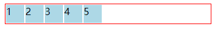
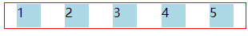
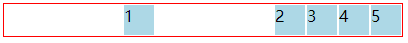
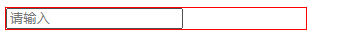

## 1. BFC

在css文档流中有3种定位方案：`普通流`、`浮动`、`绝对定位`。

W3C css2.1规范中引入了`FC(格式化上下文)`的概念。指页面中的一块渲染区域，有自己的一套渲染规则，它决定子元素将如何定位，以及和其他元素的关系和相互作用

`BFC(块级格式化上下文)`是`FC定位`方案的普通流。**具有BFC特性的元素可以看做是一个隔离了的独立容器，容器里面的元素不会在布局上影响到外面的元素，并且BFC具有普通容器所没有的一些特性**。
>简单来说，可以把`BFC`理解为一个封闭的大箱子，箱子内部的元素如何翻江倒海，都不会影响到外面的元素

### `触发BFC`
- ##### body根元素
- ##### display为inline-block、table-cells、flex
- ##### 浮动元素：float除none以外的值 `理解成浮动`
- ##### 绝对定位元素：position（absolute、fixed）理 `解成绝对定位`
- ##### overflow除了visible以外的值（hidden、auto、school） `理解成溢出隐藏效果`

### `BFC特性及应用`

##### `特性1. 同一个BFC下外边距折叠`
>###### 经常碰到div因为内部元素margin-top，导致这个div也跟着margin-top了，当时理解成内部元素的影响到父元素，让父元素margin-top了

```
<style>
  .item {
    width: 100px;
    height: 100px;
    margin: 100px;
    background: red;
  }
</style>
<body>
  <div class="item"></div>
  <div class="item"></div>
  <div class="item"></div>
</body>
```

因为`body`为BFC环境，内部元素外边距会`发生折叠`，从而实际每两个`div元素之间`边距只有`100px`。因此，我们在写代码的时候通常都会给每个子元素`item`添加一个BFC父容器，也就是添加一个`overflow: hidden`的div，让每个`item`所处环境不同，这样就避免了边距折叠
```
<body>
  <div style="overflow: hidden">
    <div class="item"></div>
  </div>
  <div style="overflow: hidden">
    <div class="item"></div>
  </div>
  <div style="overflow: hidden">
    <div class="item"></div>
  </div>
</body>
```

##### `特性2. BFC 可以包含浮动的元素（清除浮动）`
```
<div style="border: 1px solid #000">
  <div style="width: 100px;height: 100px;background: blue;float: left"></div>
</div>
```
上面的代码子元素div会`浮动到body中`，脱离文档流

让浮动元素被 **`BFC包裹`** 过后，则会 **`清除浮动`**

```
<div style="border: 1px solid #000;overflow: hidden">
  <div style="width: 100px;height: 100px;background: blue;float:left"></div>
</div>
```
> 同样是脱离文档流，但是以上方法是没法清除`绝对定位` `absolute`、`fixed`的

##### `特性3. BFC 可以阻止元素被浮动元素覆盖`

文字环绕效果，也就是一个`浮动的div`覆盖另外一个普通div，但是 **`文字不会被浮动所影响`**，造成文字环绕浮动div的效果。
```
<body>
<div style="height: 100px;width: 100px;float: left;background: lightblue">我是一个左浮动的元素</div>
<div style="width: 200px; height: 200px;background: #eee">我是一个没有设置浮动, 
也没有触发 BFC 的元素</div>
</body>
```
效果如图：
<p>
  
</p>

此时如果给第二个元素加上`BFC`，也就是加上`overflow: hidden`则会避免元素被覆盖

```
<body>
  <div style="height: 100px;width: 100px;float: left;background: lightblue">我是一个左浮动的元素</div>
  <div style="width: 200px; height: 200px;background: #eee; overflow: hidden">我是一个没有设置浮动, 
  也没有触发 BFC 的元素</div>
</body>
```
效果如图：
<p>
  
</p>

具体想要实现的效果就得根据需求而定了

---

## 2. flex配合`margin: auto`

>`display: flex`可以元素环境变为`FFC(自适应格式上下文 )`
```
<style>
  .out {
    display: flex;
    align-items: center;
    width: 100%;
    border: 1px solid red;
  }
  .out div {
    width: 30px;
    height: 30px;
    background: lightblue;
    border: 1px solid #fff;
  }
</style>
<body>
  <div class="out">
    <div>1</div>
    <div>2</div>
    <div>3</div>
    <div>4</div>
    <div>5</div>
  </div>
</body>
```

flex布局是我们经常使用的，以上代码会生成如下图所示样式。每个子元素是顺序紧挨着排列

效果如图
<p>
  
</p>

在以上代码前提下，为`子元素div`加上`margin: auto`会发生什么效果呢？
```
  <!-- 为所有div加上margin: auto -->
  .out div {
    ...
    margin: auto
  }
```
效果如图
<p>
  
</p>

在以上代码前提下，为`单个子元素div`加上`margin: auto`会发生什么效果呢？
```
  <!-- 为第一个div加上margin: auto -->
  .out div:nth-child(1) {
    margin: auto;
  }
```
效果如图
<p>
  
</p>

---

## 3. input宽度并非给元素设置`display: block`就会自动填充
```
<style>
  .out {
    width: 300px;
    border: 1px solid red;
  }
  input {
    display: block;
  }
</style>
<body>
  <div class="out">
    <input type="text" placeholder="请输入">
  </div>
</body>
```
效果如图
<p>
  
</p>

可见 `input` 并没有铺满整个父元素，所以要想设置input的默认宽度，只能使用`size`属性（ **size属性是用于定义输入字段的宽度**）

在以上代码前提下修改`input`的`size`，注意并非是style中
```
<body>
  <div class="out">
    <input type="text" placeholder="请输入" size="50">
  </div>
</body>
```
效果如图。注意黑色红色线条与之前的区别
<p>
  
</p>


### 参考文献
[10 分钟理解 BFC 原理](https://zhuanlan.zhihu.com/p/25321647)

[你未必知道的49个CSS知识点](https://juejin.cn/post/6844903902123393032#heading-0)