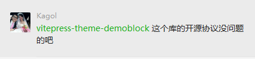

# demoblock

## 引入背景
早期进行组件开发的时候，demo展示部分需要用` ``` `包裹展示的代码块，另外组件的显示也需要同样的代码，所以同样的代码写了两遍，非常的不“银杏”。比如下面这样
```html
<!-- index.md -->

  <!-- 以下是显示组件部分 -->
  <d-icon name="emoji"><d-icon>
  <d-icon name="emoji" color="#3dcca6"><d-icon>

  <!-- 以下是暴露到文档的代码块 -->
  <!-- 需要再次重复写同样的代码 -->
  ```html
  <d-icon name="emoji"><d-icon>
  <d-icon name="emoji" color="#3dcca6"><d-icon>
　```

```
Kagol带头讨论了这个问题。大家也给出了自己的想法。

边讨论的时候我就开始看网上有没有现成的方案了。
毕竟
<p>
  
</p>

但是`vitepress`和`vue3`当时解决方案还不太多，所以也不抱太多希望。

不过最终很幸运的发现了两款支持vitepress的demo展示插件`vitepress-theme-demoblock`和`vitepress-for-component`。但最后调研发现`vitepress-for-component`是 fork 自 `vitepress`的脚手架，并不单单是一个插件了，不好集成到devui中，最后就确定了`vitepress-theme-demoblock`。

# 插件的使用

### 安装
```
npm install -D vitepress-theme-demoblock
yarn add -D vitepress-theme-demoblock
```

### 注入插件
首先我们得知道`vitepress`关于`markdown`的拓展规则，vitepress 使用`markdown-it`作为 markdown 渲染器，具体可以[查看](https://vitepress.vuejs.org/guide/markdown.html#advanced-configuration)

我们得将插件在`vitepress`的`config.js`中注册，如下面这样：
```js
module.exports = {
  markdown: {
    config: (md) => {
      // 这里可以使用 markdown-it 插件，vitepress-theme-demoblock就是基于此开发的
      const { demoBlockPlugin } = require('vitepress-theme-demoblock')
      md.use(demoBlockPlugin)
    }
  }
}
```
#### demoBlockPlugin插件的核心
`demoBlockPlugin`是插件的核心方法，函数内部注册了三个方法，如下：
```js
//  vitepress-theme-demoblock/demoblock/index.js
const demoBlockPlugin = (md, options = {}) => {
  md.use(blockPlugin, options)
  md.use(codePlugin, options)
  md.use(renderPlugin, options)
}
```
- blockPlugin： `blockPlugin`的作用是根据`markdown-it-container`插件获取到的md文档所有内容转换成的AST树，从树中获取到被语法` :::demo ` 包裹的部分，输出成大概如下的字符串格式。
```js
// content就是需要渲染组件的代码内容
`<demo sourceCode="${content}">
  <!--vue-demo:${content}:vue-demo-->
</demo>`
```
- codePlugin： `codePlugin`作用是生成描述部分`description`和代码展示部分`highlight`，使用了vue的具名插槽渲染。其中`description`可以满足md语法。比如下面这样使用。
```md
:::demo 使用`size`、`style`属性来定义 Card 的样式。
    ```vue
    <template>
      <div class="card-wrap">
        <div class="card">{{ title }}</div>
      </div>
    </template>
    ```
:::
```
最终生成的效果如图所示
<p>

</p>

红色部分就是`description`，黑色部分对应`highlight`

- renderPlugin：顾名思义渲染函数，将上面`blockPlugin`函数返回的`<!--vue-demo:${content}:vue-demo-->`部分，通过正则表达式的形式获取到需要输出的`template, script, style`内容，最终渲染出来。

> `devui`将所有`docs/.vitepress/config.js`中的配置项都单独抽离了逻辑，在阅读项目源码的时候需要注意下。

### 注入主题与插件的组件

vitepress的主题拓展可以[查看](https://vitepress.vuejs.org/guide/theming.html#extending-the-default-theme)

我们得在`docs/.vitepress/theme/index.ts`中注册`vitepress-theme-demoblock`插件的`demo`组件，如下面这样
```ts

// 主题样式
import 'vitepress-theme-demoblock/theme/styles/index.css'
// 插件的组件，主要是demo组件
import { registerComponents } from './register-components.js'

export default {
  enhanceApp({ app }) {
    registerComponents(app)
  }
}
```
那么上面引入的`register-components.js`怎么来的呢？这个文件其实不需要我们创建，可以使用脚本自动创建该文件，**这样的好处是所有需要的插件组件都不需要我们手动进行注册，全部在插件内部就能确定**，未来插件有任何改动都不需要修改这里。该文件长这样
```js
// register-components.js
import Demo from 'vitepress-theme-demoblock/components/Demo.vue'
import DemoBlock from 'vitepress-theme-demoblock/components/DemoBlock.vue'
export function registerComponents(app) {
  app.component('Demo', Demo)
  app.component('DemoBlock', DemoBlock)
}
```
自动生成该文件可以使用如下命令
```json
// package.json
"scripts": {
  "register:components": "vitepress-rc"
}
```

```bin
yarn register:components
```

至此，`vitepress-theme-demoblock`的就在vitepress中注册成功了

# 使用与效果
注册好插件过后，我们只需要在demo展示文件`index.md`中使用固定语法包裹代码就能自动生成组件demo以及代码块
```md
    :::demo 使用`sm`，`''`，`lg`来定义`Search`基本类型

    ```vue
    <template>
      <div>
        Small
        <d-search size="sm" autoFocus style="width: 200px" :delay="1000"></d-search>
        Middle
        <d-search style="width: 200px" isKeyupSearch></d-search>
        Large
        <d-search iconPosition="left" size="lg" style="width: 200px"></d-search>
        Disabled
        <d-search disabled style="width: 200px"></d-search>
      </div>
    </template>
    ```
    :::
```

生成的效果如下

<p>

</p>

效果非常棒~

# 遇到的问题

### 开源库的协议

在提议使用了`vitepress-theme-demoblock`后，有一天`Kagol`找到了我

<p>

</p>

李姐李姐，毕竟得保护知识产权嘛。于是乎，我就去插件库看了一下，在此之前，我一直认为的开源协议是这样的：
```json
// package.json
{
  "name": "vue-devui",
  "version": "0.0.1",
  "license": "MIT",
  "dependencies": {},
}
```
嗯，源码中的`package.json`有个`license`为`MIT`，ok，fine。于是乎我立马回复大佬

<p>

</p>

于是便安安心心的学习去了。

结果突然有一天，Kagol又找到了我，告诉我插件没有开源协议，并告诉我开源协议要是这样的
<p>

</p>

定了定神，于是乎，又去了解了开源协议，原来开源库必须得定义好`LICENSE`文件，原来协议分好几种：

- `MIT`: 最为宽松的协议，意味着对所有人免费，并且可以任意处置，包括使用，复制，修改，合并，发表，分发，再授权，或者销售。唯一的限制是，软件中必须包含上述版权和许可提示
- `BSD`: 需要包含一份版权提示和免责声明之外，没有任何限制
- `GNU GPL`: 保证了所有开发者的权利，同时为使用者提供了足够的复制，分发，修改的权利，可自由复制，可自由分发，可用来盈利，可自由修改
- `GNU LGPL`: 对产品所保留的权利比 GPL 少，因为 GPL 要求，使用了 GPL 代码的产品必须也使用 GPL 协议，开发者不允许将 GPL 代码用于商业产品。LGPL 绕过了这一限制
- `Apache`: 除了为用户提供版权许可之外，还有专利许可，对于那些涉及专利内容的开发者而言，该协议最适合

devui就是使用了MIT协议，所以我们可以放心大胆的使用，当然，`vitepress-theme-demoblock`也在跟开发作者邮件沟通过后，补加上了MIT协议。小伙伴们平时在使用第三方库的时候也需要注意下是否有开源协议哦。

### 插件的bug
最开始使用`vitepress-theme-demoblock`时，还是会碰到一些坑，比如下面这样
<p>

</p>

会发现组件部分已经超出了容器。本身是一个小问题，所以在向插件提了pr过后就修改好了（跟devui提pr一样的流程）。

我们在使用插件时，碰到了插件本身的问题，不妨研究一下插件，自己修改过后提pr也是一种不错的体验。后面小伙伴们也陆陆续续提了一些bug，该插件的作者也非常积极的帮忙解决了，非常棒。


