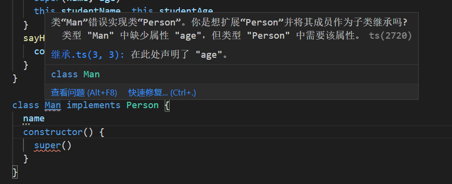
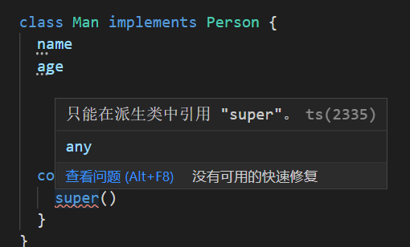
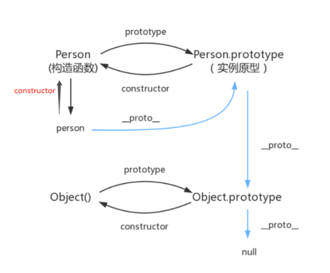

### 接口继承和实现继承
- `接口继承` 只继承方法签名（`方法签名指某个api里面的方法名，方法参数，方法类型，这些统称方法签名`），但是js中没有签名（这个概念），所以不支持接口继承
> 这儿发散一下，接口继承联想到了`java`的`extends`继承，java中只有`接口`可以被`implement`，只有`类`才能被`extends`，与`typeScript`相比，ts中一个类既可以被implement也可以被extends。但是区别在于，implement必须在类内部实现父类的所有方法并且不可以定义super，而extends不用满足且可以使用super
<p>
图1

图2

</p>

- `实现继承`ECMAScript只支持实现继承，主要依靠`原型链`来实现

### `概念`
每个构造函数`constructor`都有一个原型对象`prototype`，原型对象都包含一个指向构造函数的指针，而实例`instance`都包含一个指向原型对象的内部指针

如图所示
<p>

</p>

#### `原型链特性`
如果试图引用对象(实例instance)的某个属性,会首先在对象内部寻找该属性,直至找不到,然后才在该对象的原型(instance.prototype)里去找这个属性.

举个栗子：
```js
function Conctructor1() {
  this.p1 = 'hellow world'
}
let instance1 = new Conctructor1()
```
现在让原型对象指向另一个类型的实例，即
```js
Constructor1.prototype = instance2
```
现在基于上述原型链特性，识图引用`constructor1`构造函数的实例`instance1`的某个属性`p1`

1. 首先会在`instance1`内部属性中找一变，有无`p1`
2. 接着会在instance1.\_\_proto__()


定义父类
```javascript
function Person(name, age) {
  this.name = name
  this.age = age
}
Person.prototype.sayHi = function() {
  console.log(`I'm ${this.name} and i'm ${this.age} years old`)
}
const p = new Person('lwl', 27)
p.sayHi() // I'm lwl and i'm 27 years old
```

原型继承
```js
function Teacher() {}
Teacher.prototype = new Person('B', 26)
Teacher.prototype.constructor = Teacher

var t = new Teacher()
t.sayHi()
console.log(t instanceof Person) // true
console.log(t instanceof Teacher) // true
```