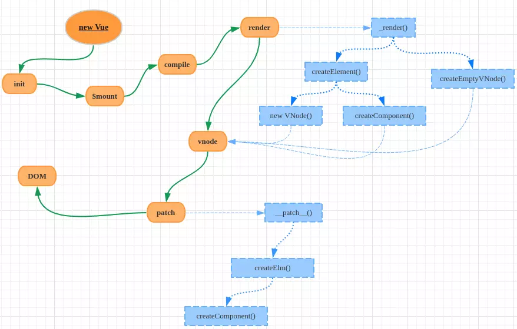

# 简述
首先`keep-alive`是一个组件，但是它不会渲染dom，有三个属性参数`include`, `exclude`, `max`。分别代表着缓存白名单，缓存黑名单，以及缓存组件最大数。**max的作用是当缓存组件超出max值时，可以优化缓存，让缓存以LRU最近最久未使用的策略去删除多余的组件**

## 组件

keep-alive组件大致长这样
```js
// src/core/components/keep-alive.js
export default {
  name: 'keep-alive',
  abstract: true, // 判断当前组件虚拟dom是否渲染成真实dom的关键
  props: {
      include: patternTypes, // 缓存白名单
      exclude: patternTypes, // 缓存黑名单
      max: [String, Number] // 缓存的组件
  },
  created() {
     this.cache = Object.create(null) // 缓存虚拟dom
     this.keys = [] // 缓存的虚拟dom的键集合
  },
  destroyed() {
    for (const key in this.cache) {
       // 删除所有的缓存
       pruneCacheEntry(this.cache, key, this.keys)
    }
  },
 mounted() {
   // 实时监听黑白名单的变动
   this.$watch('include', val => {
       pruneCache(this, name => matched(val, name))
   })
   this.$watch('exclude', val => {
       pruneCache(this, name => !matches(val, name))
   })
 },

  render () {
    const slot = this.$slots.default
    const vnode: VNode = getFirstComponentChild(slot) // 找到第一个组件对象
    const componentOptions: ?VNodeComponentOptions = vnode && vnode.componentOptions
    if (componentOptions) { // 存在组件参数
      // check pattern
      const name: ?string = getComponentName(componentOptions) // 组件名
      const { include, exclude } = this
      if ( // 根据include，exclude条件匹配是否缓存数组，不缓存直接返回vnode组件实例
        // not included
        (include && (!name || !matches(include, name))) ||
        // excluded
        (exclude && name && matches(exclude, name))
      ) {
        return vnode
      }

      const { cache, keys } = this
      // 根据组件的id和tag定义组件的缓存key
      const key: ?string = vnode.key == null
        // 同一个构造函数可能会被注册为不同的本地组件，所以单独使用cid是不够的  
        ? componentOptions.Ctor.cid + (componentOptions.tag ? `::${componentOptions.tag}` : '')
        : vnode.key
      if (cache[key]) { // 已经缓存过改组件
        vnode.componentInstance = cache[key].componentInstance
        // 让当前的key始终保持最优先，更新的原因是为了实现LRU置换策略
        // LRU: 最近最少使用策略, 选择最近最久未使用的页面予以淘汰
        // 假设缓存时发现超过了max缓存数量，则根据LRU删除最近最久未使用的实例（即是下标为0的那个key），因为当前活跃的缓存组件已经被更改到数组中的最后了
        remove(keys, key) // 从缓存的虚拟dom键中删除key
        keys.push(key) // 删除完又添加，也就是调整排序
      } else {
        // delay setting the cache until update
        // 推迟设置缓存直到更新
        this.vnodeToCache = vnode
        this.keyToCache = key
      }

      // 将该组件实例的keepAlive属性设置为true
      vnode.data.keepAlive = true // 渲染和执行被包裹组件的钩子函数需要用到
    }
    return vnode || (slot && slot[0])
  }
}
```

### render函数的作用

- 首先找到keep-alive包裹的第一个组件对象
- 根据include和exclude条件匹配是否缓存组件
- 根据组件的cid和tag定义组件的缓存key，因为单独的cid并不能保持唯一性，同一个构造函数可能会被注册为不同的本地组件。根据key查找是否缓存了该组件，如果是取出组件更新位置，当前组件已经缓存过，则让该组件放到缓存数组中的最后一个，如果设置了`max`属性，会因为`LRU`策略，删除`下标为0（最近最久未使用）`的组件。
- 设置当前组件`keepAlive`属性为true，作用是可以让初始化生命周期时`keep-alive不被渲染`。

### 渲染
先看一张vue渲染导图
<p>

</p>

Vue的渲染时从`render阶段开始的`，但`keep-alive`的渲染是在`patch`阶段，这是构建组件树（虚拟dom树），并将vnode转化成DOM结点的过程。

简述从`render`到`patch`过程

从new Vue开始
```js
import App from './App.vue'

new Vue({
    render: h => h(App)
}).$mount('#app')
```

- Vue在渲染的时候先调用原型上的_render函数将组件对象转化成一个VNode实例；而_render是通过调用createElement和createEmptyVNode两个函数进行转化；
- createElement的转化过程会根据不同的情形选择new VNode或者调用createComponent函数做VNode实例化；
- 完成VNode实例化后，这时候Vue调用原型上的_update函数把VNode渲染成真实DOM，这个过程又是通过调用patch函数完成的（这就是patch阶段了）

### keep-alive组件的渲染
keep-alive不会生成真正的结点

```javascript
// src/core/instance/lifecycle.js
export function initLifecycle (vm: Component) {
  const options = vm.$options

  // 找到第一个非abstract的父组件实例
  // Vue在初始化生命周期的时候，为组件实例建立父子关系会根据abstract属性决定是否忽略某个组件
  // 在keep-alive中，设置了abstract:true，那Vue就会跳过该组件实例
  // 最后构建的组件树中就不会包含keep-alive组件
  // 那么由组件树渲染成的DOM树自然也不会有keep-alive相关的节点了
  let parent = options.parent
  if (parent && !options.abstract) {
    while (parent.$options.abstract && parent.$parent) {
      parent = parent.$parent
    }
    parent.$children.push(vm)
  }
}

```

### keep-alive包裹的组件是如何使用缓存的

```javascript
  // src/core/vdom/patch.js
  function createComponent (vnode, insertedVnodeQueue, parentElm, refElm) {
    let i = vnode.data
    if (isDef(i)) {
      const isReactivated = isDef(vnode.componentInstance) && i.keepAlive
      if (isDef(i = i.hook) && isDef(i = i.init)) {
        i(vnode, false /* hydrating */)
      }
      // 在调用init钩子之后，如果vnode是一个子组件，
      // 它应该创建一个子实例并挂载它。 子组件还设置了占位符vnode的elm。
      // 在这种情况下，我们只需要返回元素就可以了。 

      // 在首次加载被包裹组建时，由keep-alive.js中的render函数可知，
      // vnode.componentInstance的值是undfined，keepAlive的值是true，
      // 因为keep-alive组件作为父组件，它的render函数会先于被包裹组件执行；
      // 那么只执行到i(vnode,false)，后面的逻辑不执行；

      // 再次访问被包裹组件时，vnode.componentInstance的值就是已经缓存的组件实例，
      // 那么会执行insert(parentElm, vnode.elm, refElm)逻辑，
      // 这样就直接把上一次的DOM插入到父元素中。
      if (isDef(vnode.componentInstance)) {
        initComponent(vnode, insertedVnodeQueue)
        insert(parentElm, vnode.elm, refElm) // keep-alive将缓存的DOM(vnode.elem) 插入父元素中
        if (isTrue(isReactivated)) {
          reactivateComponent(vnode, insertedVnodeQueue, parentElm, refElm)
        }
        return true
      }
    }
  }

```

### 只执行一次的钩子
```javascript
// src/core/vdom/create-component.js
const componentVNodeHooks = {
  init (vnode: VNodeWithData, hydrating: boolean): ?boolean {
    if ( // 当组件的vnode.componentInstance和vnode.data.keepAlive同时存在时，就不进行$mount
      // 过程，也就不会执行组件的所有钩子函数（beforeCreate、created、mounted等）
      vnode.componentInstance &&
      !vnode.componentInstance._isDestroyed &&
      vnode.data.keepAlive
    ) {
      // kept-alive components, treat as a patch
      const mountedNode: any = vnode // work around flow
      componentVNodeHooks.prepatch(mountedNode, mountedNode)
    } else {
      const child = vnode.componentInstance = createComponentInstanceForVnode(
        vnode,
        activeInstance
      )
      child.$mount(hydrating ? vnode.elm : undefined, hydrating)
    }
  },
}
```

### 可重复的activated

在patch的阶段，最后会执行invokelinsertHook函数，而这个函数就是去调用组件实例自身的insert钩子
```javascript
// src/core/vdom/patch.js
function invokeInsertHook (vnode, queue, initial) {
  if (isTrue(initial) && isDef(vnode.parent)) {
      vnode.parent.data,pendingInsert = queue
  } else {
    for(let i =0; i<queue.length; ++i) {
      queue[i].data.hook.insert(queue[i]) // 调用VNode自身的insert钩子函数
    }
  }
}
```

再看insert钩子：

```javascript
const componentVNodeHooks = {
  // init()
  insert (vnode: MountedComponentVNode) {
    const { context, componentInstance } = vnode
    if (!componentInstance._isMounted) {
      componentInstance._isMounted = true
      callHook(componentInstance, 'mounted')
    }
    if (vnode.data.keepAlive) {
      if (context._isMounted) {
        queueActivatedComponent(componentInstance)
      } else {
        activateChildComponent(componentInstance, true/* direct */)
      }
    }
    // ...
  }
}
```
在这个钩子里面，调用了activateChildComponent函数递归地去执行所有子组件的activated钩子函数：

```javascript
// src/core/instance/lifecycle.js
export function activateChildComponent (vm: Component, direct?: boolean) {
  if (direct) {
    vm._directInactive = false
    if (isInInactiveTree(vm)) {
      return
    }
  } else if (vm._directInactive) {
    return
  }
  if (vm._inactive || vm._inactive === null) {
    vm._inactive = false
    for (let i = 0; i < vm.$children.length; i++) {
      activateChildComponent(vm.$children[i])
    }
    callHook(vm, 'activated')
  }
}
```
相反地，deactivated钩子函数也是一样的原理，在组件实例（VNode）的destroy钩子函数中调用deactivateChildComponent函数。