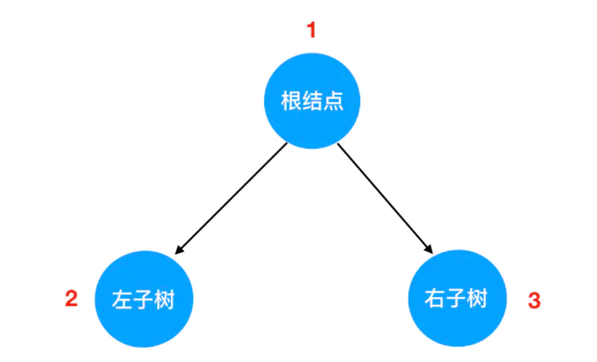

以一定的顺序规则，逐个访问二叉树的所有结点，这个过程就是二叉树的遍历。
- 先序遍历
- 中序遍历
- 后序遍历
- 层次遍历

`先序`、`中序`、`后序`其实是针对于根结点的，也就是说在循环结点时：

- 先序：根节点 > 左子树 > 右子树
- 中序：左子树 > 根节点 > 右子树
- 后序：左子树 > 右子树 > 根节点

按照实现方式不同，又可以分为
- 递归遍历（先、中、后序遍历）
- 迭代遍历（层次遍历）

## 先序遍历
<p>

</p>

用js代码生成一颗二叉树
```js
const root = {
  val: '根结点',
  left: {
    val: '左子树1'
    left: {
      val: '左子树1的左子树'
      left: null,
      right: null
    },
    right: {
      val: '左子树1的右子树',
      left: null,
      right: null
    }
  },
  right: {
    val: '右子树1',
    left: null,
    right: null
  }
}
```

**递归函数的编写要点**
- `递归式`：它指的是你每一次重复的内容是什么。在这里，我们要做先序遍历，那么每一次重复的其实就是 根结点 -> 左子树 -> 右子树 这个旅行路线。
- `递归边界`：指遍历什么时候停下来，编码实现里对应着一个 `return语句`

先序代码逻辑思路
```js
const recursion = (root) => {
  // 所有遍历函数的入参为根结点对象-注意所有是包含中序、后序
  if (!root) return
  
  console.log('当前结点', root.val) // 注意当前结点调用的位置，与中序、后续对比
  recursion(root.left)
  recursion(root.right)
}
```

中序代码逻辑思路
```js
// 所有遍历函数的入参都是树的根结点对象
function inorder(root) {
    // 递归边界，root 为空
    if(!root) {
        return 
    }
     
    // 递归遍历左子树 
    inorder(root.left)  
    // 输出当前遍历的结点值
    console.log('当前遍历的结点值是：', root.val)  
    // 递归遍历右子树  
    inorder(root.right)
}
```

后序代码逻辑思路
```js
function postorder(root) {
    // 递归边界，root 为空
    if(!root) {
        return 
    }
     
    // 递归遍历左子树 
    postorder(root.left)  
    // 递归遍历右子树  
    postorder(root.right)
    // 输出当前遍历的结点值
    console.log('当前遍历的结点值是：', root.val)  
}
```

