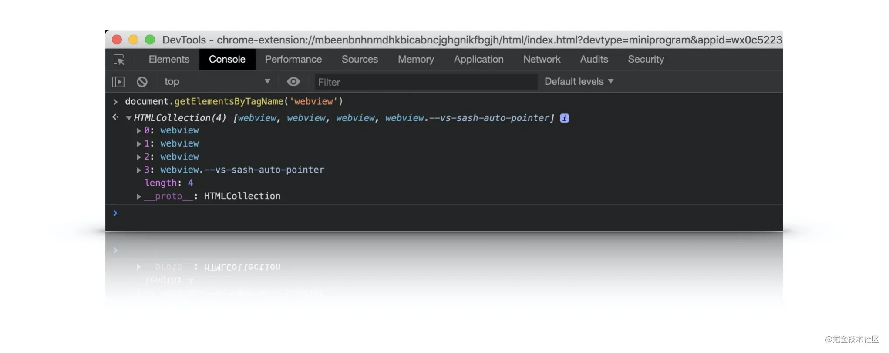
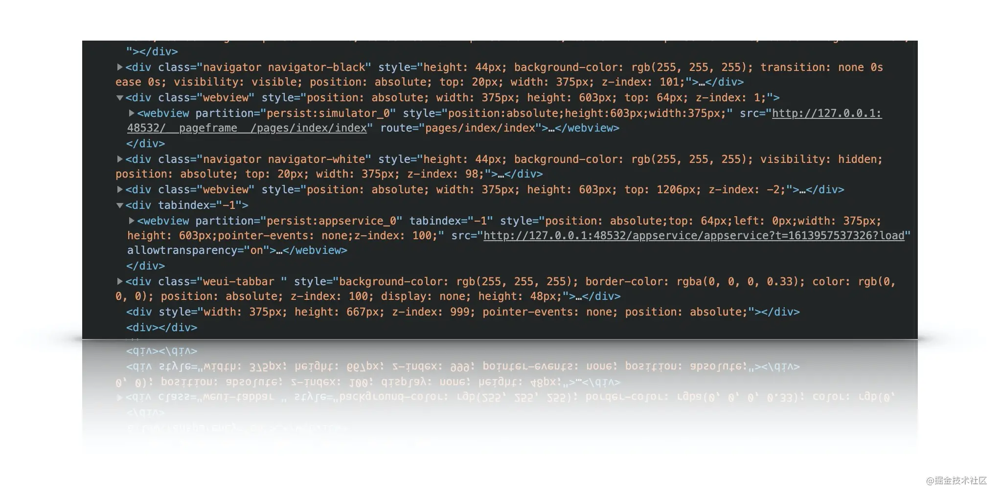
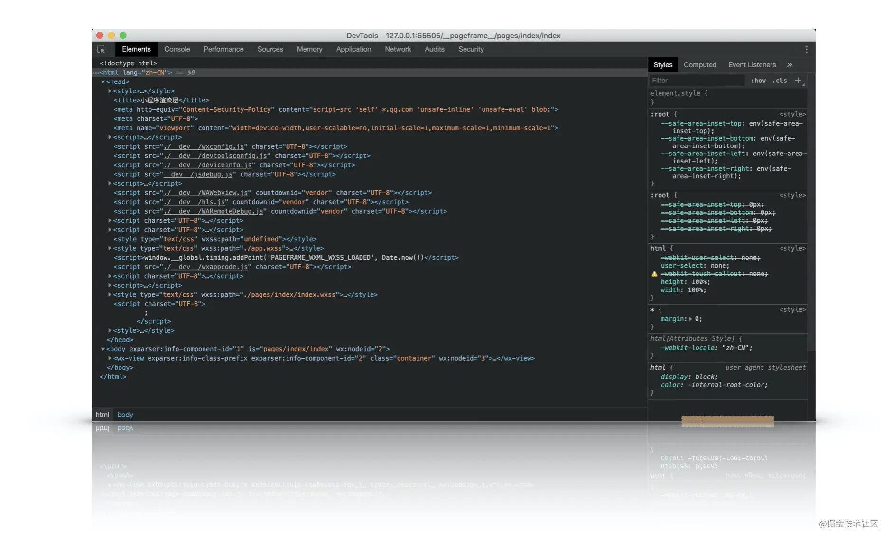
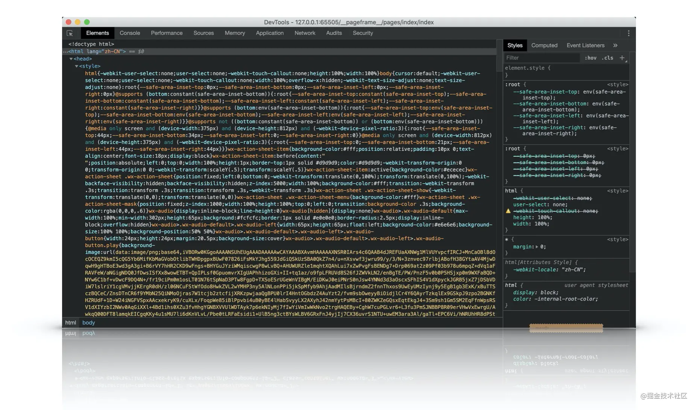
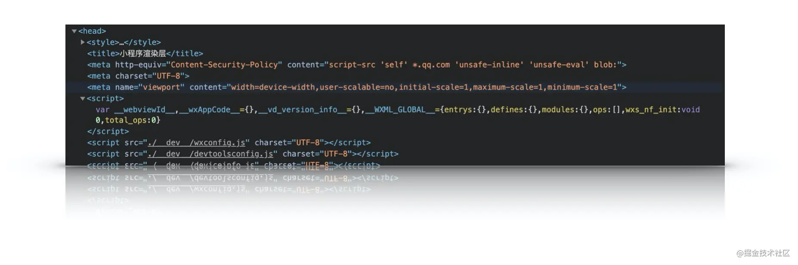
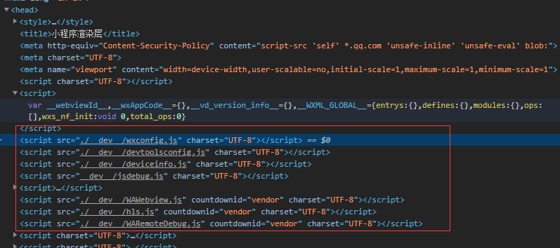
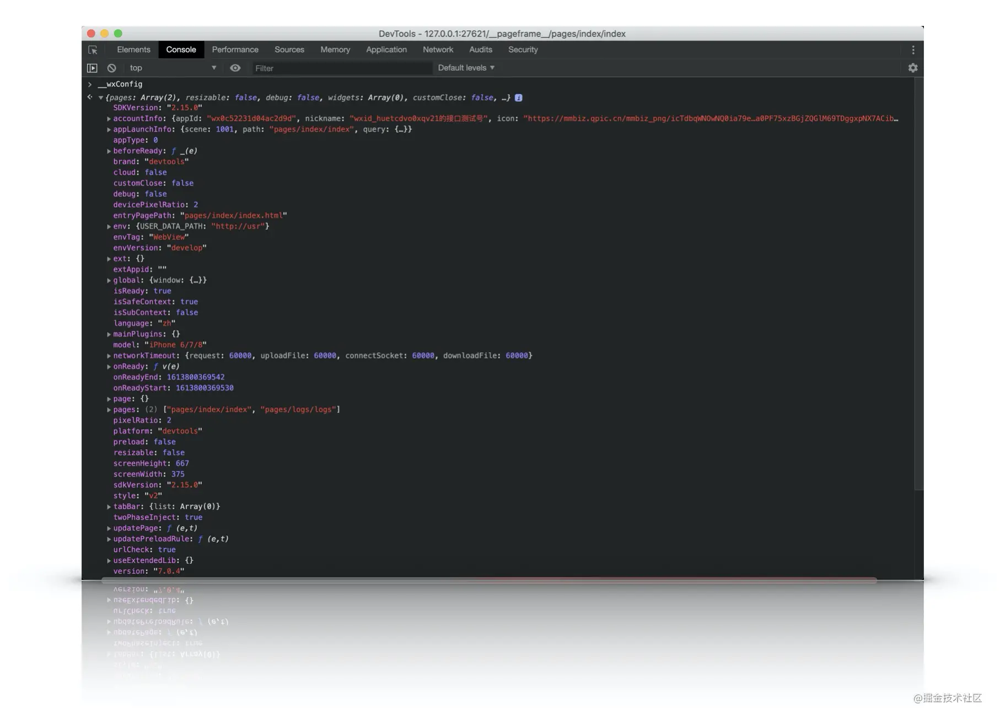
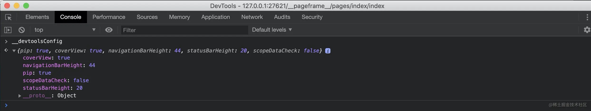
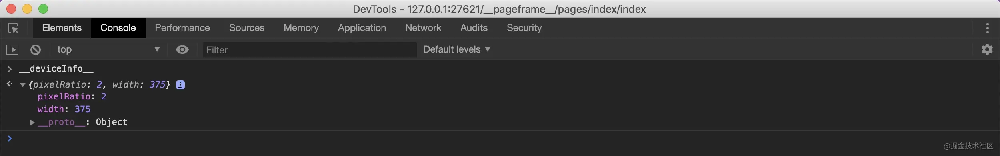

本章内容分解：
- 寻找渲染线程文件
- webview容器设计
- 渲染层文件解析


1. 进入调试微信开发者工具模式，可以发现默认页面会有4个webview：
`视图层的webview`，`业务逻辑层webview`，`调试器的webview`和`编辑区的webview`

<p>

</p>
<p>

</p>
上方webview层src路径为pageframe/pages/index/index 是渲染层视图，渲染的就是我们进来时候开到的初始页面。 
下方webview层src路径为appservice/appservice?*** 是逻辑层视图。微信开发者工具模拟了在移动端的双线程结构。
每个webview可以理解为在移动端跑的一条线程

从上方我们自己寻找webview代码节点可以知道第一个就是page/index/index路径相对应的webview。
通过showdevTools方法来打开调试此webview界面的调试器。命令如下：
```js
document.getElementsByTagName('webview')[0].showDevTools(true, null)
```

<p>

</p>
打开此为 小程序渲染层， 从head区域开始分析，从上到下：

第一个style标签中包含了一些基础style标签。展开的部分截图如下：

<p>

</p>

第一个style标签处理了webview层的基础组件的样式初始化。这里没有`rpx`，这里就是单纯的`css`，css选择器，css的px

再往下面这个区域，首先可以看到几个全局变量，从英文名称上就可以知道意思：
<p>

</p>

- webviewId: 从这个id又可以再次印证webview层不止一个。
- wxAppCode: 整个页面的json wxss wxml编译之后都存储在这里，下面有个script标签就是它，下面会讲到。
- Vd_version_info: 版本信息

> 后面的js文件如果想看的话，把鼠标放在路径上邮件`open in new tap`即可

<p>

</p>

`./dev/wxconfig.js`是小程序默认总配置项，包括用户自定义与系统默认的整合结果。在控制台输入__wxConfig可以看出打印结果
<p>

</p>

`./dev/devtoolsconfig.js`小程序开发者配置，包括navigationBarHeight,标题栏的高度，状态栏高度，等等，控制台输入__devtoolsConfig可以看到其对应的信息
<p>

</p>

`./dev/deviceinfo.js` 设备信息，包含尺寸/像素点pixelRatio
<p>

</p>

`./dev/jsdebug.js` debug工具。

`./dev/WAWebview.js` 渲染层底层基础库，底层基础库后面会重点讲到。

`./dev/hls.js` 优秀的视频流处理工具。

`./dev/WARemoteDebug.js` 底层基础库调试工具

`WARemoteDebug Script`标签下面的script标签内容，展开后非常的长。这里呢也是渲染层的重中之重，这里呢就是后面要讲到的渲染层-编译virtualDOM章节以及渲染层-WXSS动态适配章节。
