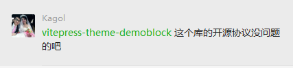
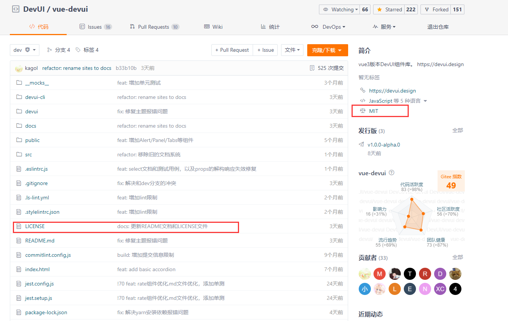

# 怎么学习提升
- 看技术分享文章，推荐掘金社区
- 看技术书籍，分享三本
  - 1. JavaScript高级程序设计
  - 2. 图解HTTP
  - 3. JavaScript函数式编程指南
- 看学习视频，但是一定得有自己的“观后感”
- 参与开源（学习是一件不断的忘记与拾起的过程，参与开源可以让学以致用，加深理解）

> 可以在谷歌插件安装上掘金插件，方便平时浏览一些高质量的技术文章[掘金chrome插件](https://juejin.cn/extension)

# 理解设计模式
小伙伴们在平时开始写代码之前，一定得先设计好自己的组件，不求最优解，但得是一个高性能，可读性，可维护性都不错的情况。这个推荐小伙伴们一定要学习下JavaScript设计模式，至少弄明白工厂模式，发布订阅模式，策略模式。围绕`“开放封闭”`的思想进行编程。开放封闭也就是：
- 对扩展开放，意味着有新的需求或变化时，可以对现有代码进行扩展，以适应新的情况
- 对修改封闭，意味着类一旦设计完成，就可以独立完成其工作，而不要对类进行任何修改

平时写代码的时候会随着需求的增多，发现代码逻辑相当复杂，不停的if else，自己写的代码都能绕昏。所以理解好设计模式能让我们写出更优秀的代码。

# 参与开源时怎么写组件
## 暴露install方法
vue组件根据官网插件的规则，应该暴露install方法，因为vue在`app.use()`时，会调用插件的`install`注册组件。但是这一步已经在`devui-cli`中自动生成了，这里为不懂的小伙伴简单介绍一下。
```js
import type { App } from 'vue'
import Search from './src/search'

Search.install = function(app: App) {
  app.component(Search.name, Search)
}

// 这里是暴露给按需引用的，比如   import { Search } from 'vue3-devui'
export { Search }

// 这里是暴露给vitepress框架的，让在docs文档中能够直接使用组件
// 可以查看 devui/vue-devui.ts和docs/.vitepress/theme/index.ts，这两个文件也都是devui-cli自动生成
// 关于vue插件的使用可以参考[官网](https://www.vue3js.cn/docs/zh/guide/plugins.html#%E6%8F%92%E4%BB%B6)
export default {
  title: 'Search 搜索框',
  category: '通用',
  install(app: App): void {
    app.use(Search as any)
  }
}

```

## 照搬轮子
怎么写一个优秀的组件，建议就是`照搬轮子`，当然如果能自己设计优秀的组件那更佳。对于学习者来说，看别人的优秀代码（会经常让自己不由得发出感叹：原来还可以这样），并加以自己对框架和组件的理解，写出符合需求的的组件也是非常不错的提升手段。举个例子，在我写search组件时，先是查看了ng版本的devui search组件源码，尽量复原原有api，不过angular和vue3差别太大，尽量明白逻辑就行。在vue3的写法上，查看了其他开源框架和其他田主在UI组件库开发时，怎么去使用vue3以及typescript，怎么去定义一个类。

以前写typescript代码时，用的最多的就是any，void，或者简单的定义number，string类型，比如这样：
```typescript
  // 设置数据
  async set(key: string, value: any, seconds?: number) {
    value = JSON.stringify(value);
    if (!this.client) {
      await this.getClient();
    }
    if (seconds) {
      await this.client.set(key, value, 'EX', seconds);
    } else {
      await this.client.set(key, value);
    }
  }
```

现在会使用更加具体的接口类去定义，有些类是自己写，有些类是框架导出的，比如这样
```typescript
import { SetupContext, Ref } from 'vue'
export interface KeydownReturnTypes {
  onInputKeydown: (e: KeyboardEvent) => void
  onClickHandle: () => void
  useEmitKeyword: (e: string) => void
}
type EmitProps = 'update:modelValue' | 'searchFn'
export const keydownHandles = (ctx: SetupContext<(EmitProps)[]>, keywords: Ref<string>, delay: number): KeydownReturnTypes => {
  ...
}
```

还有泛型的使用，不过也在学习中啦。不过很多内容以前都只有一个概念，未付诸于实践，但是参与开源过后，让学以致用。

## 组件的逻辑抽离
因为vue3提供了`vca(vue3 compisition api)`，让以前vue2揉成一团的methods方法，可以充分拆分开。让逻辑更可读，代码更容易维护。从`search组件`来说，通过需求api，可以分析出api可以分成两块，`输入框内容的定义、修改`和`键盘的绑定事件`。所以可以通过vca，将api逻辑进行拆分，通过hook的形式调用，比如：
```javascript
  // index.ts
import { SearchProps, searchProps } from './search-types'
import { keywordsHandles } from '../hooks/use-search-keywords'
import { keydownHandles } from '../hooks/use-search-keydown'
export default defineComponent({
  props: searchProps,
  setup(props: SearchProps, ctx) {
    const rootClasses = getRootClass(props)
    // 输入框内容定义、删改
    const { keywords, clearIconShow, onClearHandle } = keywordsHandles(ctx, props)

    // 键盘回车事件
    const { onInputKeydown, onClickHandle, useEmitKeyword } = keydownHandles(ctx, keywords, props.delay)
    
    // 双向绑定
    const onInputUpdate = (event: string) => {
      if (props.isKeyupSearch) {
        useEmitKeyword(event)
      }
      keywords.value = event
      ctx.emit('update:modelValue', event)
    }

    return () => {
      return (
        <div class={rootClasses.value}>
          ...
        </div>
      )
    }
  }
})
```

```javascript
/**
 * use-search-keywords.ts
 * 输入框内容定义、删改操作
 */
import { ref, watch, computed, SetupContext } from 'vue'
import { SearchProps, KeywordsReturnTypes } from '../src/search-types'
type EmitProps = 'update:modelValue' | 'searchFn'

export const keywordsHandles = (ctx: SetupContext<(EmitProps)[]>, props: SearchProps): KeywordsReturnTypes => {
  const keywords = ref('') // 输入框内容
  // 监听是否有双向绑定，将绑定的值传递给keyword，因为需要清除输入框
  watch(() => props.modelValue, (val)=> {
    keywords.value = val
  }, { immediate: true })
  // 清空输入框
  const onClearHandle = () => {
    keywords.value = ''
    // 清空输入框时更新modelValue为空
    ctx.emit('update:modelValue', '')
  }
  const clearIconShow = computed(() => {
    return keywords.value.length > 0
  })
  return {
    keywords,
    clearIconShow,
    onClearHandle
  }
}
```

```javascript
/**
 * use-search-keydown.ts
 * 清空按钮显示、隐藏
 */
import { SetupContext, Ref, } from 'vue'
import { KeydownReturnTypes } from '../src/search-types'
import { debounce } from 'lodash'
const KEYS_MAP = {
  enter: 'Enter'
} as const

type EmitProps = 'update:modelValue' | 'searchFn'

export const keydownHandles = (ctx: SetupContext<(EmitProps)[]>, keywords: Ref<string>, delay: number): KeydownReturnTypes => {
  // 删除按钮显示
  const onInputKeydown = ($event: KeyboardEvent) => {
    switch ($event.key) {
      case KEYS_MAP.enter:
        handleEnter($event)
        break
      default:
        break
    }
  }
  const handleEnter = ($event: KeyboardEvent) => {
    if ($event.target instanceof HTMLInputElement) {
      const value = $event.target.value
      useEmitKeyword(value)
    }
  }
  const onClickHandle = () => {
    useEmitKeyword(keywords.value)
  }
  const useEmitKeyword = debounce((value: string) => {
    ctx.emit('searchFn', value)
  }, delay)
  return {
    onInputKeydown,
    useEmitKeyword,
    onClickHandle
  }
}
 
```

这也是函数式编程思想，通过vca拆分函数，组合函数，复用函数。

## jsx的学习
jsx本身的语法没几个，参考下文档就可以了。

## scss的使用
开发时，因为很多公用的css，比如`颜色`、`字体`、`动画`等已经在style组件中定义好了，直接拿来用就行了，这样也让整体UI库风格统一，不产生误差，建议大家在开发时，查看下ng版devui的css使用，如果发现有对公用css的引用时，也需要查看下vue版本的devui有无该css，有的话就需要使用。这个时候就需要研究ng版本的dom以及style了，学习下别人怎么设计dom结构和scss写法。

公用的scss所在目录：
```markdown
|-- devui                                             
    |-- style                                                   
        |-- core                                                              
        |   |-- _animation.scss                                               
        |   |-- _cdk.scss                                               
        |   |-- _dropdown.scss                                          
        |   |-- _font.scss                                           
        |   |-- _form.scss                                           
        |-- mixins                                                                   
            |-- _clearfix.scss                                                           
            |-- _flex.scss                                                           
            |-- _hover.scss                                                           
            |-- _size.scss                                                           
        |-- devui.scss  
```
这里举例了几个公用scss，还有更多大家可以查看devui源码

## 怎么区分公用的和非公用class
在开发时，首先查看ng版本官网组件的dom结构，查看class和css，如果是带有`devui-`开头并且没有接组件的说明是公用的css，比如
官网中
```html
<!-- 当前组件定义的class：devui-cascader-list -->
<ul class="devui-cascader-list ng-star-inserted" style="width: 200px;"></ul>
<!-- 公用的class：devui-dropdown-menu -->
<div class="custom-class devui-drop-menu-wrapper devui-dropdown-menu ng-tns-c62-28" style="display: block;"></div>
```
其中 `devui-dropdown-menu`这种就是公用的，而`devui-cascader-list`就是当前组件定义的class，因为带有`cascader`组件标识，而`dropdown`因为是一个全局的可复用的下拉组件，所以style是全局公用的。如果不确定是否是公用，复制class全局搜索一遍。

另外在查看css时，发现有很多使用css函数调用`var()`看到这些可以复制var中的内容，到源码中全局搜索，一般都是公用css属性。在开发时，需要使用这些公用的css，而非自己重新定义。因为当组件需要diy皮肤样式的时候，直接修改公用的css属性就能达到效果了，如果这个时候某些动画或者颜色是自己定义的，那么也就达不到效果了。
```css
/* ng版本官网css */
[_nghost-med-c73] > li[_ngcontent-med-c73] span[_ngcontent-med-c73] {
    transition: color .1s cubic-bezier(.645,.045,.355,1),background-color .1s cubic-bezier(.645,.045,.355,1);
    transition: color var(--devui-animation-duration-fast,.1s) var(--devui-animation-ease-in-out-smooth,cubic-bezier(.645,.045,.355,1)),background-color var(--devui-animation-duration-fast,.1s) var(--devui-animation-ease-in-out-smooth,cubic-bezier(.645,.045,.355,1));
}
```

# 对于第三方框架使用时的思考
最开始devui在使用vitepress时，所有的demo文档源码都是直接暴露在页面中，这样比较难看。所以我就想怎么能够像devui ng官网一样，将demo源码收起来，需要看的时候再展示出来。于是就开始调研，也发现了解决方案，最开始定义了两种插件，`vitepress-theme-demoblock`和`vitepress-for-compoent`。后者其实是一个脚手架，因为devui在当时已经使用好了vitepress了，为了避免过大的修改，就放弃了。所以就采用了vitepress-theme-demoblock。

## 开源库的协议
在提议使用了vitepress-theme-demoblock后，有一天`Kagol`找到了我

<p>

</p>

李姐李姐，毕竟得保护知识产权嘛。于是乎，我就去插件库看了一下，在此之前，我一直认为的开源协议是这样的：
```json
// package.json
{
  "name": "vue-devui",
  "version": "0.0.1",
  "license": "MIT",
  "dependencies": {},
}
```
嗯，源码中的`package.json`有个`license`为`MIT`，ok，fine。于是乎我立马回复大佬

<p>

</p>

于是边安安心心的学习去了。

结果突然有一天，大佬找到了我，告诉我插件没有开源协议，并告诉我开源协议要是这样的
<p>

</p>

定了下神，于是乎，又去了解了开源协议，原来开源库必须得定义好`LICENSE`文件


