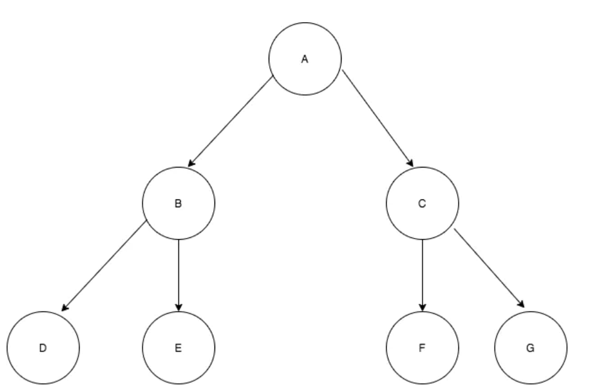
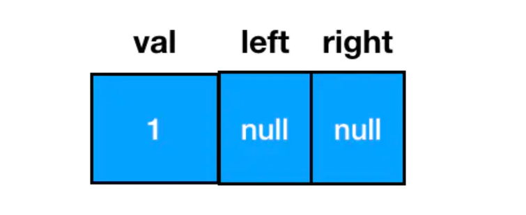
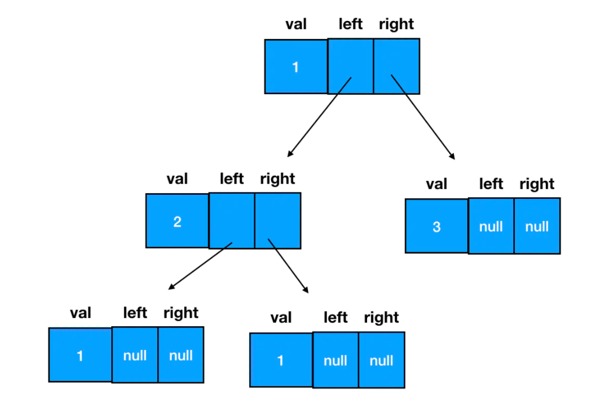

# 数据结构
前端一般需掌握：`数组`、`栈`、`队列`、`链表`、`树（二叉树）`

## 数组
数组创建方法
```js
// 第一种，也是最经常用的一种
const arr = [1, 2]
// 第二种，当我们不知道内部元素时
const arr = new Array(3) // [empty, empty, empty]
// 由第二种创建数组
const arr = (new Array(3)).fill(1)) // [1, 1, 1] 
// 但是由fill创建的二维数组就会有局限性，因为fill一个引用类型的值的话，就会发生改变一个从而改变所有的情况
const arr = (new Array(3)).fill([])
arr[0].push(1)
console.log(arr) // [[1], [1], [1]]
```

一维数组和二维数组的区别

`一维数组`可以理解成一条直线 `[1]`
`二维数组`可以理解成一条平面，也就是数组中的元素为数组。比如 `[[1], [1]]`

二维数组的创建

```js
const len = arr.length
const arr = []
for(let i = 0; i < len; i++) {
  arr[i] = []
}
```

二维数组的访问

通过`两层for循环`访问二维数组
```js
for (let i = 0; i < arr1.length; i++) {
  for (let j = 0; j < arr1[i].length; j++) {
    console.log(arr1[i][j])
  }
}
```

>一维数组用 for 循环遍历只需一层循环，二维数组是两层，三维数组就是三层。依次类推，N 维数组需要 N 层循环来完成遍历。

---

## 栈和队列

在JavaScript中，`栈和队列的实现一般都是依赖于数组`，大家完全可以把栈和队列看成`特别的数组`
>（注：实际上，栈和队列作为两种运算受限的线性表，用链表来实现也是没问题的。只是从前端面试做题的角度来说，基于链表来实现栈和队列约等于脱裤子放屁（链表实现起来会比数组麻烦得多，做不到开箱即用），基本没人会这么干。这里大家按照数组的思路往下走就行了）

**两者的`区别`在于，它们各自对`数组的增删操作`有着不一样的限制**

数组的增

```js
const arr = [1,2]
arr.unshift(0) // [0,1,2] 添加到元素头部
arr.push(3) // [0, 1, 2, 3]添加到数组尾部
arr.splie(1, 0 , 4) // [0, 4, 1, 2, 3] // 改变任意位置元素，增或者删或者替换
```

数组的删

```js
const arr = [1, 2, 3, 4]
arr.shift() // [2, 3, 4] 删除头部元素
arr.pop() // [2, 3] 删除尾部元素
arr.splie(0, 1) // [3] 删除从下标0开始的一个元素

```

### 栈
栈是一种`后进先出`的数据结构，在`js中`其实是只能用`pop`和`push`完成增删的`"数组"`

两个特征
1. 只允许从尾部添加元素
2. 只允许从尾部取出元素

对应到数组中，就是push和pop方法。因此，在JavaScript中，栈就是限制只能用push添加元素，用pop来删除元素的一种特殊数组

```js
const stack = []
stack.push(1)
stack.push(2)
stack.push(3)
// 入栈
while(stack.length) {
  const now = stack[stack.length - 1]
  console.log('当前出栈元素', now)
  stack.pop()
}
console.log(stack) // []
```

### 队列
队列是一种先进先出的数据结构，在js中其实就是只用`push`和`shift`完成增删的`"数组"`

特征
1. 只允许从尾部添加元素
2. 只允许从头部移除元素

```js
const queue = []
// 入队
queue.push(1)
queue.push(2)
queue.push(3)
// 出队
while(queue.length) {
  const now = queue[0]
  console.log('出队元素', now)
  queue.shift()
}
console.log(queue) // []

```

>总结：在栈元素出栈时，我们关心的是栈顶元素（数组的最后一个元素）。队列元素出队时，我们关心的是队头元素（数组的第一个元素）

## 链表

链表和数组相似，它们都是有序的列表、都是线性结构（有且仅有一个前驱，有且仅有一个后继）。
`不同点`在于，链表中，数据单位的名称叫做`结点`，而结点和结点的分布，在内存中可以是`离散`的。
这个“离散”是相对于数组的`“连续”`来说的。

JS 中的链表，是以嵌套的对象的形式来实现的，每一个结点的结构都包括了两部分的内容：数据域和指针域：
```js
{
    // 数据域
    val: 1,
    // 指针域，指向下一个结点
    next: {
        val:2,
        next: ...
    }
}
```

需要值得注意的是结点的`插入`以及`删除`

插入

在node1和node2中插入node3，其实就是将node1的next指向node3
```js
// 如果目标结点本来不存在，那么记得手动创建
const node3 = new ListNode(3)     
// 把node3的 next 指针指向 node2（即 node1.next）
node3.next = node1.next
// 把node1的 next 指针指向 node3
node1.next = node3
```

删除 

在node1和node2之间删除node3，node3会被垃圾回收机制回收
```js
node1.next = node3.next 
```

链表的增删逻辑`空间复杂度`为 O(1)

数组的增删逻辑`空间复杂度`为 O(n) 线性增长

但是通过arr[1]的形式去访问元素，空间复杂度会降为常数级别 O(1)

## 树
<p>

</p>

树的概念与特性
- 树的层次计算规则：根节点所在的那一层为第一层，其子节点为第二层，以此类推
- 结点和树的“高度”计算规则：叶子结点高度记为1，每向上一层高度就加1，逐层向上累加至目标结点时，所得到的的值就是目标结点的高度。树中结点的最大高度，称为`“树的高度”`
- `“度”`的概念：一个结点开叉出去多少个子树，被记为结点的“度”，比如图中，根节点的“度”就是3
- `叶子结点`：叶子结点就是度为0的结点。在上图中，最后一层的结点全为0，所以这一层的结点称为叶子结点

### 二叉树
二叉树指满足以下要求的树：
- 它可以没有根节点，作为一颗空树存在
- 左右两边结点不可互换
- 如果它不是空树，那么必须由根节点、左子树和右子树组成，且左右子树都是二叉树。左右树同样遵循可以为空。如下图
<p>

</p>


二叉树中的结点结构：
- 数据域
- 左树指针
- 右树指针

用js定义二叉树
```js
// 二叉树结点的构造函数
function TreeNode(val) {
  this.val = val;
  this.left = this.right = null;
}
// 当你需要新建一个二叉树结点时，直接调用构造函数、传入数据域的值就行了：
const node  = new TreeNode(1)
```
如此便能得到一个值为 1 的二叉树结点，从结构上来说，它长这样
<p>

</p>

可以料想到一颗完整的二叉树长这样
<p>

</p>