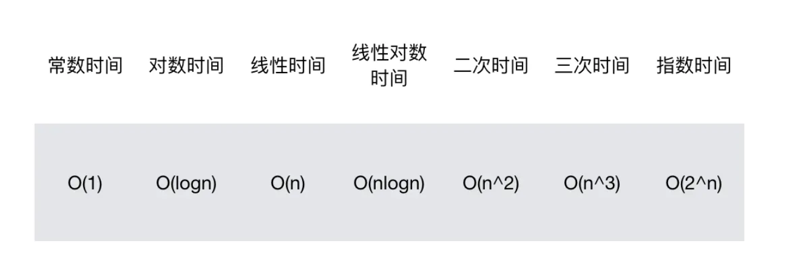

## 时间复杂度
时间复杂度可以看循环体最内层一共被调用了多少次

```js
// 一维数组
function traverse1(arr) {
  var len = arr.length
  for(var i=0;i<len;i++) {
    console.log(arr[i])
  }
}
// 二维数组
function traverse2(arr) {
  var outLen = arr.length

  for(var i=0;i<outLen;i++) {
    var inLen = arr[i].length

    for(var j=0;j<inLen;j++) { 
        console.log(arr[i][j])
    }
  }
}
```

>遍历 N 维数组，需要 N 层循环，我们只需要关心其最内层那个循环体被执行多少次就行了。

我们可以看出，规模为 `n` 的一维数组遍历时，最内层的循环会执行 `n` 次，其对应的时间复杂度是 `O(n)`；规模为 `n*n` 的二维数组遍历时，最内层的循环会执行 `n*n` 次，其对应的时间复杂度是 `O(n^2)`。


对数复杂度
```js
function fn(arr) {
    var len = arr.length  
    
    for(var i=1;i<len;i=i*2) {
        console.log(arr[i])
    }
}
```

这个算法中，我们关心的就是 `console.log(arr[i])` 到底被执行了几次，换句话说，也就是要知道 `i < n（ len === n）` 这个条件是在 `i` 递增多少次后才不成立的。用公式来描述就是：
```js
// 假设 i 在以 i=i*2的规则递增了 x 次之后，i<n 开始不成立（反过来说也就是 i>=n 成立）。那么此时我们要计算的其实就是这样一个数学方程：
2^x >= n
// 可得
x >= log2^n
// 注意涉及到对数的时间复杂度，底数和系数都是要被简化掉的，所以O(n)可以表示为
O(n) = logn
```

常见的时间复杂度按照从小到大的顺序排列，有以下几种：
<p>

</p>

## 空间复杂度
空间复杂度是对一个算法在运行过程中临时占用`存储空间大小的量度`。和时间复杂度相似，它是内存增长的趋势。

O(1)复杂度例子
```js
function traverse(arr) {
    var len = arr.length
    for(var i=0;i<len;i++) {
        console.log(arr[i])
    }
}
```

因为此算法中，占用空间的变量有
```js
arr
len
i
```

尽管有多次循环，但是都是时间上的开销。循环体在执行时，并没有开辟新的内存空间。因此，整个 traverse 函数对内存的占用量是恒定的，它对应的空间复杂度就是 `O(1)`。

O(n)复杂度例子
```js
function fun(n) {
  let arr = []
  for (let i = 0; i < n; i++) {
    arr[i] = i
  }
  return arr
}
```

在这个 fun 中，涉及到的占用内存的变量有以下几个：
```js
n 
arr
i
```

arr最终的大小是由输入的 `n` 的大小决定的，它会随着 `n` 的增大而增大、呈一个线性关系。因此这个算法的空间复杂度就是 `O(n)`。
由此我们不难想象，假如需要初始化的是一个规模为 `n*n` 的数组，那么它的空间复杂度就是 `O(n^2)` 啦。